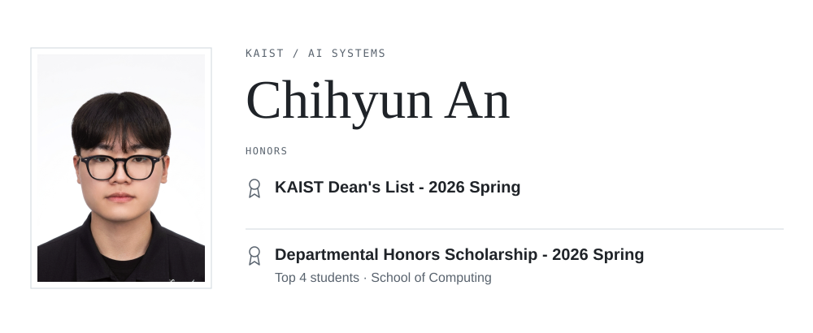

<picture>
  <source media="(prefers-color-scheme: dark) and (max-width: 600px)" srcset="assets/header-dark-mobile.svg">
  <source media="(max-width: 600px)" srcset="assets/header-light-mobile.svg">
  <source media="(prefers-color-scheme: dark)" srcset="assets/header-dark.svg">
  
</picture>

**AI systems researcher.**  
KAIST · School of Computing · Electrical Engineering double major  
Expected graduation: **August 2027**

[Email](mailto:ach0309@kaist.ac.kr) &nbsp; · &nbsp; [GitHub](https://github.com/ChihyunAhn0309) &nbsp; · &nbsp; [LinkedIn](https://www.linkedin.com/in/chihyun-an-2267691b5/) &nbsp; · &nbsp; [CV (PDF)](assets/Chihyun-Ahn-CV.pdf)

## Research interests

| | Research area | Focus |
| :--- | :--- | :--- |
| 01 | **Computer systems & architectures for AI** | Learning over time |
| 02 | **LLM Serving Systems** | Serving infrastructure |
| 03 | **On-device AI** | AI on local devices |
| 04 | **Continuous Learning on Edge Devices** | Learning over time |

Broader interests

Computer systems for AI · GPU-efficient architecture · GPU-optimized neural architectures · Reinforcement learning & deep learning · Efficient training · Reproducible experiments

## Research experience

**Continuous Learning on Edge Devices**  
Independent research · **Dec 2025 – Present**

---

**LLM Serving System Simulator**  
Independent research · Dec 2025 – Jun 2026

---

**VLM-based Rewards for Reinforcement Learning**  
Independent research · Dec 2024 – Mar 2025

 

<strong>Education & teaching</strong>

| | Details |
| :--- | :--- |
| **Education** | KAIST · Mar 2021 – Present School of Computing · Electrical Engineering double major Expected graduation: August 2027 |
| **Teaching** | Teaching Assistant · CS101 Introduction to Programming Spring 2026 · Fall 2026 |
| **Selected courses** | Graduate Computer Architecture · Operating Systems and Lab · Computer Networks · Machine Learning · Deep Learning · Reinforcement Learning |
| **Programming** | C · Python · Scala |

## Open-source tools

| [experiment-watchdog ↗](https://github.com/ChihyunAhn0309/experiment-watchdog) | [train-recipe-sweep ↗](https://github.com/ChihyunAhn0309/train-recipe-sweep) |
| :--- | :--- |
| Local experiment monitoring with bounded recovery after failures. | Evidence-based recipe search for full fine-tuning and LoRA. |
| Python · Experiment tooling | Python · Training workflows |

<!-- Profile maintenance: see PROFILE_EDITING.md. Replace assets/portrait.png to update the photo. -->
